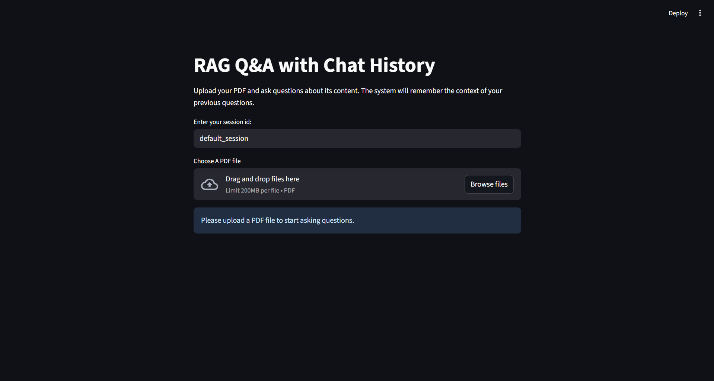

# 📄 RAG Q&A with PDF & Chat History


> Transform your PDFs into an interactive, context-aware Q&A experience! Ask questions about your PDFs and get concise, accurate answers while retaining the entire conversation context. Perfect for research, documentation, or learning from large PDF files.  

---

## 🚀 Features

- **📂 Multiple PDF Uploads:** Upload one or multiple PDFs simultaneously.
- **🔍 Intelligent Question-Answering:** Ask questions about the content of your PDFs and get answers derived directly from the document.
- **🧠 Context-Aware Responses:** The system remembers previous questions and answers, allowing follow-up questions that reference past interactions.
- **💬 Chat History Management:** Each session tracks conversation history for continuity across multiple questions.
- **⚡ HuggingFace Embeddings:** Semantic understanding of documents using `all-MiniLM-L6-v2` embeddings.
- **📚 Recursive Document Chunking:** Large PDFs are split intelligently to ensure optimal retrieval and context matching.
- **💾 Vector Database:** Chroma DB stores document embeddings for fast and accurate semantic search.
- **🔑 Groq LLM Integration:** Uses Groq’s `Gemma2-9B-IT` model for powerful, concise responses.
- **🖥️ Interactive Web App:** Built with Streamlit for a smooth, user-friendly interface.
- **🔒 Secure API Access:** Groq API key entry ensures private and secure usage.
- **📝 Standalone Question Reformulation:** Converts follow-up questions into independent queries for more precise retrieval.
- **🛠️ Lightweight & Extensible:** Modular code for easy updates or integration with other LLMs.

---

## 🖼️ How It Works

1. **Upload PDFs:** Drag and drop one or more PDFs into the uploader.  
2. **PDF Loading & Splitting:** Each PDF is loaded and split into smaller chunks for better semantic understanding.  
3. **Embeddings:** Each chunk is converted into vector embeddings using HuggingFace’s `all-MiniLM-L6-v2`.  
4. **Vector Storage:** Embeddings are stored in Chroma DB for efficient retrieval.  
5. **Question Input:** Type your question into the input box.  
6. **Context-Aware Retrieval:** The system searches for relevant chunks and reformulates your question if it depends on previous chat history.  
7. **Answer Generation:** Groq LLM generates concise answers (max 3 sentences) using the retrieved context.  
8. **Chat History:** All questions and answers are stored per session for follow-up queries.

---

## 🛠️ Installation & Setup

1. **Clone this repository:**
   ```bash
   git clone https://github.com/yourusername/rag-pdf-chat.git
   cd rag-pdf-chat
